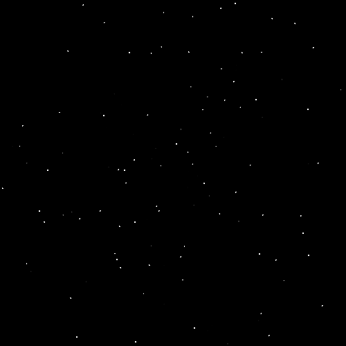

# 太极图形课S1-作业5：星空（Win95 屏幕保护）

## 背景简介
参考：http://www.shadertoy.com/view/XtBSWt 实现
部分复刻 win95 中星空的屏幕保护
## 成功效果展示

## 整体结构（Optional）
脉络清晰的结构能完整展示你的设计思想，以及实现方式，方便读者快读代入，建议可以在repo的目录中包含如下内容：
这个部分希望大家可以大作业中加入，小作业中可以选择性加入（如果不加也是OK的）
```
-LICENSE
-|data
-README.MD
-starfield.py
```

## 运行方式
运行环境：
```
[Taichi] version 0.8.4, llvm 10.0.0, commit 895881b5, win, python 3.8.10
[Taichi] Starting on arch=cuda
```
直接运行： python3 stardield.py
